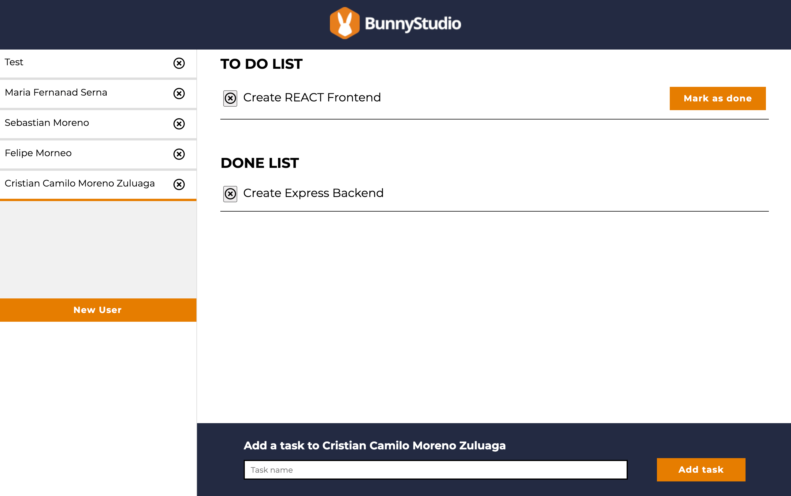

[](https://app.netlify.com/sites/bs-challange/deploys)

# # bs-frontend 🐰💻💅🏻

<p align="center">
  
</p>

This challenge project in React demonstrates my skills as a frontend developer.

- ⚛️  React.js - JSX- Context - Hooks
- 👩🏻‍🎤  Emotion.sh
- 👩🏻‍🎨  Atomic Design

### Prerequisites

- [Git](https://git-scm.com/)
- [Node.js and npm](https://nodejs.org) Node >= 14.15.x, npm >= 6.14.x
- [Backend Project](https://github.com/khriztianmoreno/bs-backend) - Follow the steps outlined in the README

### Developing

1. Run `npm install` to install frontend dependencies.

2. Configure the env
```shell
$ cp env.example .env
```

3. Update `.env` with the required info. *The url of the backend server.*

4. Run `npm start` to start the development server.

### To Do

- [ ] Responsive design
- [ ] Update user name
